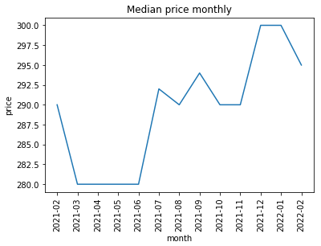
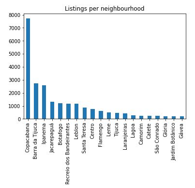
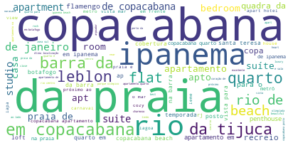

# Insights from AirBnB data from Rio de Janeiro

AirBnB is already the primary way a lot of people search for accommodations when traveling.  

In this post, I can provide a little help in a data-driven way if:

- If you are in doubt when is the best time (say **the cheapest**) to visit Rio
- Where to stay in Rio
- You are in doubt on how to post your first accommodation as a host

## The cheapest months to go 

Deciding whether a month is good or not for traveling can be tricky, if you are a foreigner, you may not be aware of the vacation periods in another country. To take this doubt out of the map, below is a graph of the median price of accommodations in Rio:

As we can notice, prices skyrocket by the end of the year, probably because many brazilians go there on New Year's Eve and demand goes all the way up. The months from March to May tend to have lower prices, so if the price is a crucial aspect when planning your visit to Rio, these the months to choose. 

## Where to stay then?

The city of Rio de Janeiro is enormous, so there comes the question: where to stay then? With its more than 150 neighborhoods, it may be easy to get lost, below I plotted the 20 neighborhoods with the most accommodations.

The top location is the famous Copacabana beach, with more than 7.000 accommodations. In second comes Barra da Tijuca, a more recent part of the city but far from the main sightseeings, and in third comes Ipanema, the famous beach of the all-time best bossa nova Garota de Ipanema.

Most places tend to be in the south of the city, where most touristic places are, if that's what you want, I definitely recommend renting a place in Copacabana or Ipanema. But if you look for beautiful beaches, avoiding some tourists and a more calm place you should go for Barra da Tijuca. 

## How to write the title of your first accommodation

Below is a word cloud representing all titles of every accommodation in Rio. The bigger the word, the more frequent it is. As we can see, hosts tend to emphasize the location (Copacabana, Barra) and sightseeings (praia) when writing listings names.

So, if you ever wondered a practical way to write the name of your first accommodation on AirBnB, writing the location and famous places around may be a good start.

### Bonus

If you want to check out how I analyzed the data used to plot these graphs in Python, a notebook is available here. It contains other interesting insights and a machine learning model to predict the price of an accommodation. 
