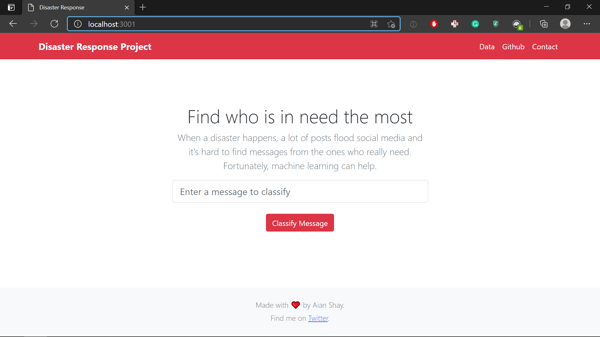
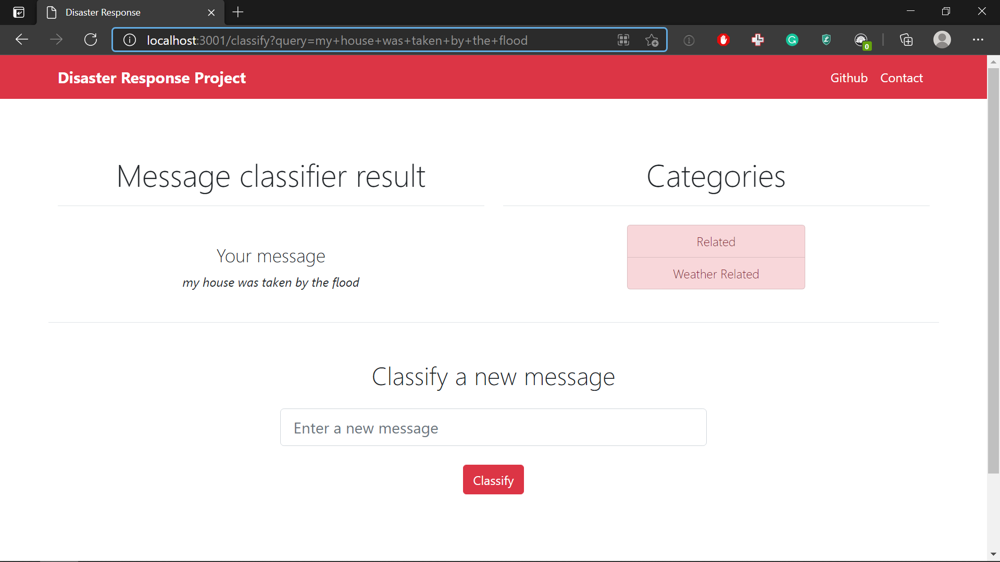

# Disaster Response Pipeline Project

When a disaster happens, a lot of posts flood social media and it's hard to find messages from the ones who really need. Fortunately, machine learning can help. In this project, an ETL pipeline is implemented from data cleaning to data loading. And a Flask web app is used to deploy a Random Forest model that classifies a disaster message in categories such as 'food', 'help', 'medical-aid', etc.

## Dependencies

- Python (>= 3.7.4)
- sklearn (>= 0.24.1)
- numpy (>= 1.19.5)
- nltk (>= 3.5)
- Jinja2 (>= 2.10.3)
- Flask (>= 1.1.2)
- Pandas (>= 1.1.5)
- Plotly (>= 4.14.3)
- sqlalchemy (>= 1.4.3)
- bootstrap 5

## Instructions

1. Run the following commands in the project's root directory to set up the database and train the Random Forest model.

    - To run ETL pipeline that cleans data and stores in database
        `python data/process_data.py data/disaster_messages.csv data/disaster_categories.csv data/DisasterResponse.db`
    - To run ML pipeline that trains classifier and saves the trained model
        `python models/train_classifier.py data/DisasterResponse.db models/classifier.joblib`

2. Run the following command in the app's directory to run Flask web app.
    `python run.py`

3. Go to http://localhost:3001/

## Screenshots

